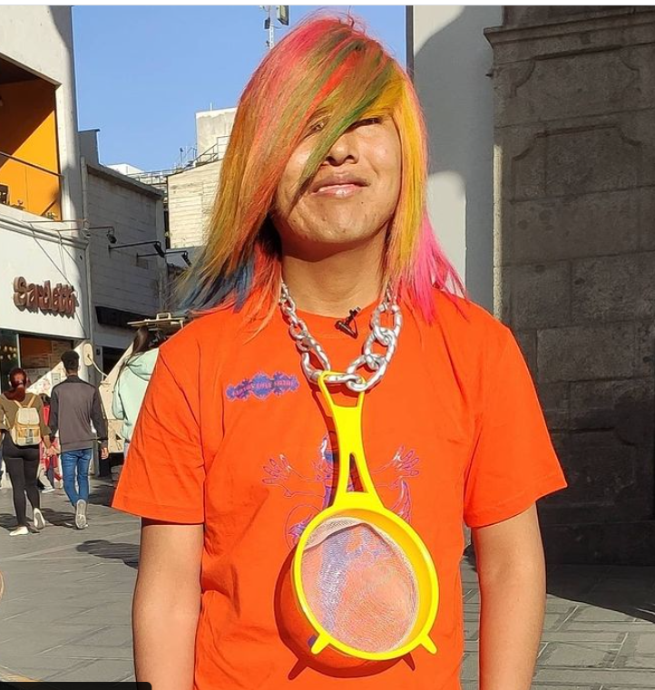
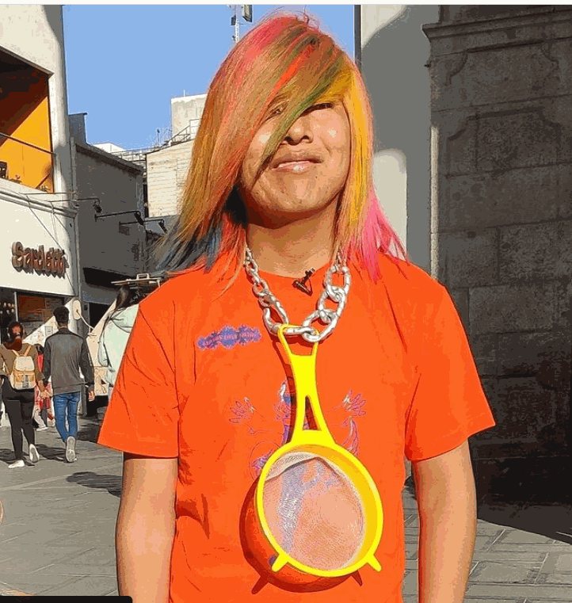
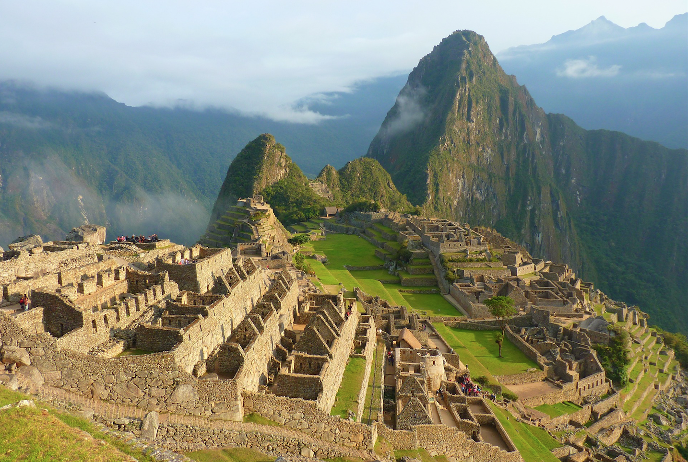
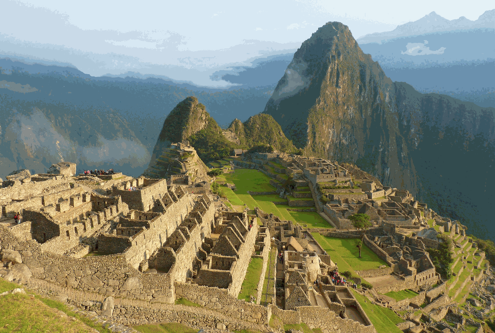
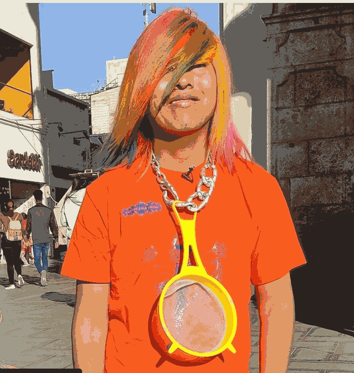
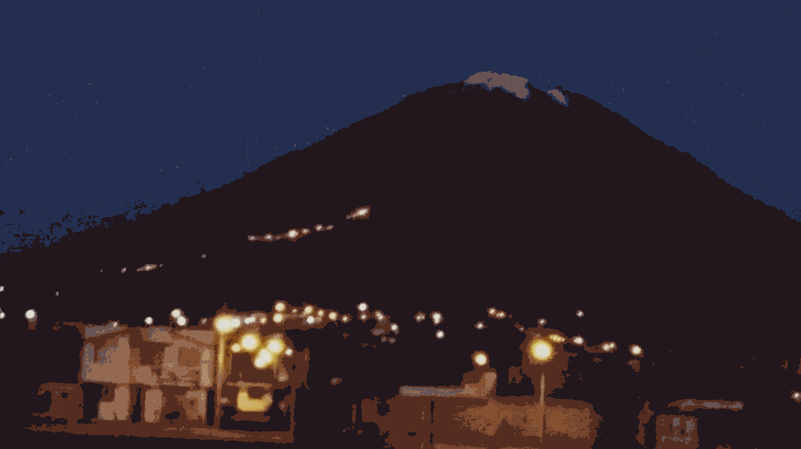
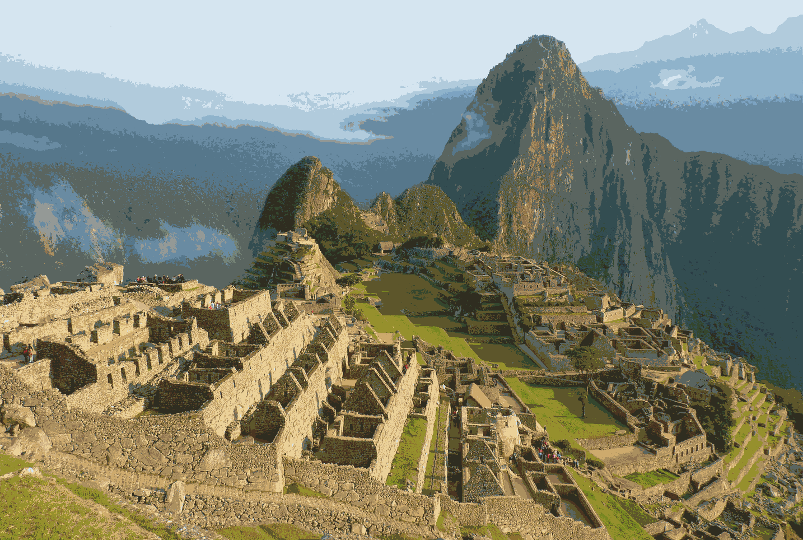

# Laboratorio 04: *Color Quantization* con Octree

El presente repositorio alberga el desarrollo del laboratorio 04 del curso de Estructura de datos avanzados de la carrera de Ciencia de la Computación en la Universidad Nacional de San Agustín de Arequipa.

# Integrantes

1. PERCA QUISPE, Joel Cristian

2. ESPINOZA PEÑALOZA, Edgar Alfonso

3. VILCHEZ MOLINA, Misael Svante

# Objetivos

* Describir, implementar la estructura de datos OcTree.

* Analizar el funcionamiento de la estructura OcTree e image quantization.

# Materiales y recursos

* Ordenador

* Python 3.9.x

* Pillow

* VSCode

# Resultados

## Con 256 colores

1. Ejemplo 1
    
    * Imagen original

        

    * Imagen reducida

        

1. Ejemplo 2
    
    * Imagen original

        

    * Imagen reducida

        

1. Ejemplo 3
    
    * Imagen original

        

    * Imagen reducida

        

## Con 64 colores

1. Ejemplo 1
    
    * Imagen original

        

    * Imagen reducida

        

1. Ejemplo 2
    
    * Imagen original

        

    * Imagen reducida

        

1. Ejemplo 3
    
    * Imagen original

        

    * Imagen reducida

        